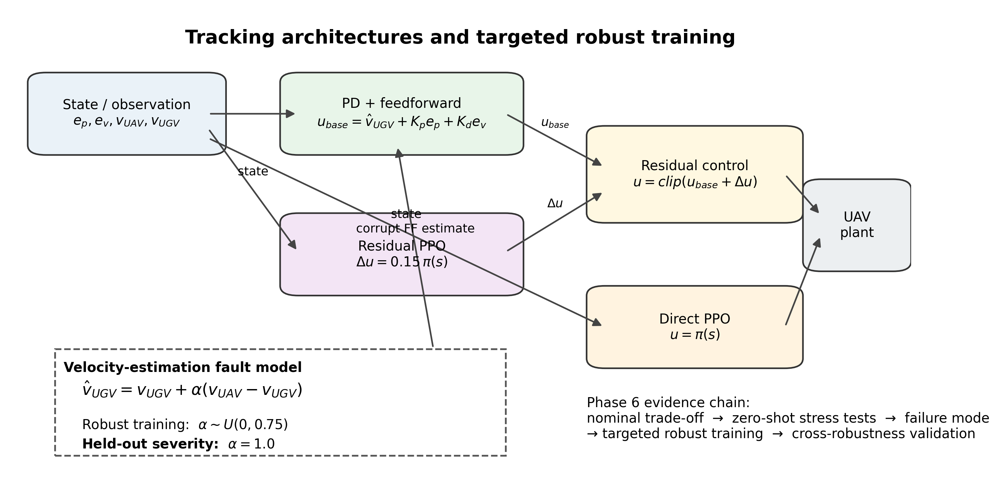
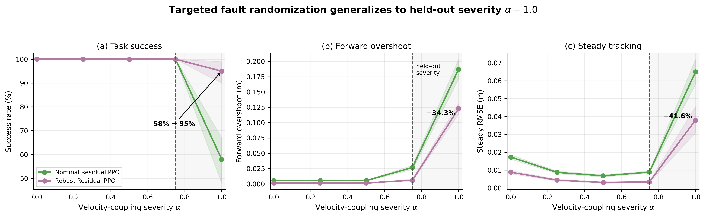
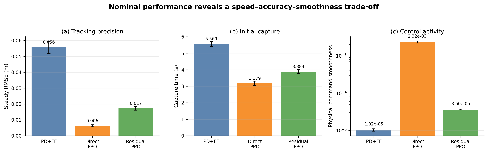
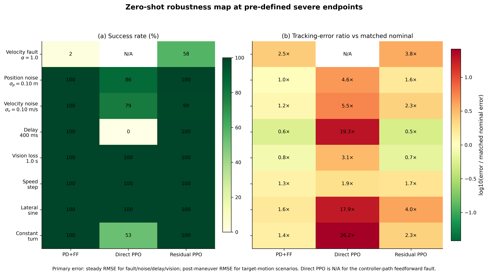
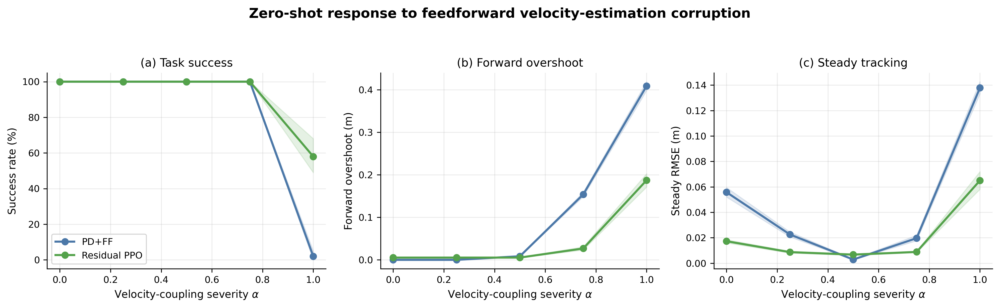
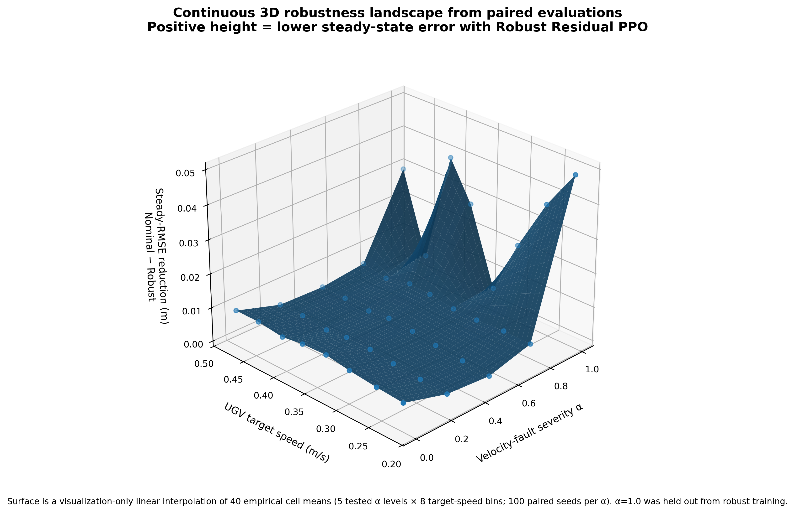
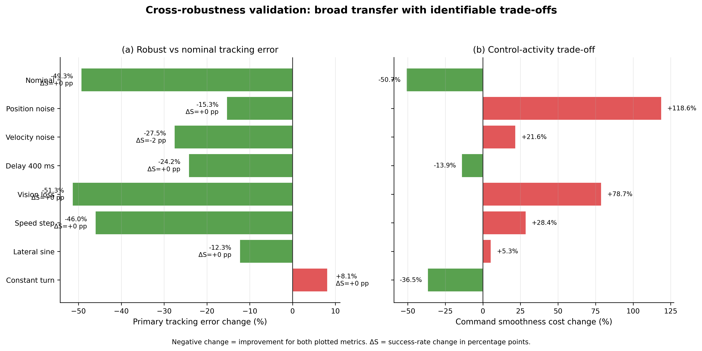

# Robust Residual PPO for UAV Tracking under Velocity-Estimation Faults

[中文说明](README_zh-CN.md)

A simulation-based reinforcement-learning study for **UAV tracking of a moving ground target**, comparing classical PD+feedforward, Direct PPO, Residual PPO, and a targeted robust Residual PPO trained with fault-domain randomization.

The central question is:

> **Can a residual policy preserve the structure and smoothness of a classical controller while learning enough correction authority to remain robust when the feedforward target-velocity estimate becomes corrupted?**

<p align="center">
  
</p>

---

## Headline Result

The dominant failure mode was modeled as a velocity-estimation contamination in the explicit feedforward path:

`v_hat_UGV = v_UGV + alpha (v_UAV - v_UGV)`

A Robust Residual PPO policy was then trained **from scratch** with one severity sampled per episode from:

`alpha ~ Uniform(0, 0.75)`

while `alpha = 1.0` was held out from training.

At the held-out severe condition:

| Metric | Nominal Residual PPO | Robust Residual PPO | Change |
|---|---:|---:|---:|
| Success rate | 58% | **95%** | **+37 pp** |
| Steady RMSE | 0.0650 m | **0.0379 m** | **−41.6%** |
| Forward overshoot | 0.187 m | **0.123 m** | **−34.3%** |

<p align="center">
  
</p>

---

## What I Implemented

My technical work represented in this repository includes:

- Built the **2D UAV–UGV tracking simulator** and Gymnasium environments, including randomized initial states and target speeds.
- Implemented the **PD+feedforward**, **Direct PPO**, and **Residual PPO** controller pipelines.
- Designed the Residual PPO architecture around a structured controller with **±0.15 m/s residual authority per axis**.
- Formalized the **velocity-estimation coupling fault model** that reproduces excessive feedforward compensation in the control path.
- Designed and trained **Robust Residual PPO** from scratch using `alpha ~ U(0, 0.75)`, with `alpha=1.0` reserved as a held-out severity.
- Implemented stress-test environments for **position/velocity noise, observation delay, temporary vision loss, and unseen target motion**.
- Built paired **100-episode evaluation pipelines** with fixed test seeds and retained episode-level CSV results.
- Built the final analysis layer that validates result consistency, generates publication-style figures/tables, and consolidates the evidence chain.

See [`docs/CONTRIBUTIONS.md`](docs/CONTRIBUTIONS.md) for a more explicit separation between project work and third-party RL infrastructure.

---

## Controller Architectures

### PD + Feedforward

`u_base = v_UGV + Kp e_p + Kd e_v`

### Direct PPO

The policy directly outputs the full planar velocity command.

### Residual PPO

`u = u_base + Delta u_RL`

The learned correction is deliberately bounded, preserving the structured controller as the main control pathway.

Key parameters:

- `Kp = 0.45`
- `Kd = 0.10`
- residual scale = `0.15 m/s` per axis
- simulation step = `0.05 s`
- episode duration = `20 s`

---

## Nominal Performance: Accuracy–Speed–Smoothness Trade-off

| Method | Success | Steady RMSE | Capture time | Command smoothness |
|---|---:|---:|---:|---:|
| PD+FF | 100% | 0.0558 m | 5.569 s | **0.000010** |
| Direct PPO | 100% | **0.0063 m** | **3.179 s** | 0.002325 |
| Residual PPO | 100% | 0.0173 m | 3.884 s | 0.000036 |

<p align="center">
  
</p>

Interpretation: Direct PPO is strongest nominally in speed/accuracy but is much more control-active. Residual PPO forms an intermediate **accuracy–capture–smoothness compromise**.

---

## Zero-Shot Robustness Stress Tests

The frozen evaluation suite tests the nominal controllers under predefined severe endpoints for:

- feedforward velocity-estimation fault
- position observation noise
- velocity observation noise
- observation delay
- temporary vision loss
- speed-step target motion
- lateral-sine target motion
- constant-turn target motion

<p align="center">
  
</p>

Representative severe-endpoint results:

| Condition | Direct PPO success | Residual PPO success |
|---|---:|---:|
| Position noise `sigma_p=0.10 m` | 86% | **100%** |
| Velocity noise `sigma_v=0.10 m/s` | 79% | **99%** |
| Observation delay `400 ms` | 0% | **100%** |
| Constant turn `0.25 rad/s` | 53% | **100%** |

The controller-path velocity fault is not applied to Direct PPO because Direct PPO has no equivalent explicit feedforward path; it is therefore intentionally reported as `N/A` for that experiment.

---

## Failure-Mode Sweep

<p align="center">
  
</p>

The velocity-estimation fault is the key bridge between an engineering failure mode and the simulation study: as `alpha` increases, the feedforward estimate becomes increasingly contaminated by UAV velocity, producing severe forward overshoot and eventual task failure in the structured baseline / nominal residual controller.

---

## Continuous 3D Robustness Landscape

The paired alpha-sweep results also support a continuous visualization of how the benefit of robust training changes with both **velocity-fault severity** and the randomized **UGV target speed**.

<p align="center">
  
</p>

The vertical axis is the paired reduction in steady-state tracking error:

`steady RMSE reduction = nominal Residual PPO − robust Residual PPO`

so positive height means the robust policy has lower steady-state RMSE. The surface is built from the actual paired episode data in `robust_residual_alpha_sweep_raw.csv`: 100 matched seeds at each tested `alpha ∈ {0, 0.25, 0.50, 0.75, 1.0}`. Episodes are aggregated into eight target-speed bins at each tested alpha, and the continuous surface is **linear interpolation for visualization only**; it does not represent additional unmeasured experiments.

Across the 40 empirical alpha-by-speed cells, the mean reduction is positive, with the largest gains concentrated near the held-out severe endpoint `alpha=1.0`. The exact empirical cell means used by the figure are saved in `results/phase6/fig7_robustness_landscape_cells.csv`.

---

## Cross-Robustness after Targeted Training

Targeted fault randomization improves the condition-specific primary tracking error in **7 of 8** cross-validation conditions, but the improvement is not free of trade-offs.

<p align="center">
  
</p>

Reported trade-offs include:

- high velocity noise: success `99% → 97%`
- constant-turn target: primary error `+8.1%`
- severe position noise: command-smoothness cost `+118.6%`

The intended claim is therefore **broad positive transfer with identifiable trade-offs**, not universal improvement.

---

## Reproducibility

### Install

```bash
python -m venv .venv
# Windows: .venv\Scripts\activate
# Linux/macOS: source .venv/bin/activate
pip install -r requirements.txt
```

### Regenerate the final analysis package

The repository includes the frozen raw/summary CSVs used for the final figures and tables. No retraining is required to regenerate the Phase 6 analysis:

```bash
python -m analysis.run_phase6
```

Expected outputs:

```text
results/phase6/
plots/phase6/
tables/phase6/
```

### Train Robust Residual PPO from scratch

```bash
python -m train.train_robust_residual_ppo
```

### Evaluate nominal vs robust Residual PPO over the fault sweep

```bash
python -m evaluation.evaluate_robust_residual_ppo
```

---

## Repository Structure

```text
robust-residual-ppo-uav-tracking/
├── controllers/        # classical controller code
├── envs/               # simulator + nominal / residual / robustness environments
├── train/              # PPO / Residual PPO / robust-training scripts
├── evaluation/         # stress tests and paired evaluations
├── analysis/           # frozen Phase 6 consolidation pipeline
├── models/             # compact trained policies used by the evaluations
├── results/            # raw and summary CSV evidence
├── plots/phase6/       # seven final figures (PNG + SVG)
├── tables/phase6/      # final CSV / Markdown / LaTeX tables
├── docs/               # contributions, protocol, interpretation, Phase 6 guide
├── requirements.txt
├── NOTICE.md
└── README.md
```

---

## Scientific Scope and Caveats

This is a **simulation-based control study**, not a claim of direct sim-to-real deployment of the learned policy.

Important interpretation boundaries:

- The velocity fault corrupts only the explicit feedforward velocity estimate; PPO observations remain uncorrupted in that specific test.
- `alpha=1.0` is a **held-out severity of the same fault family**, not a completely unseen fault type.
- The temporary-vision-loss test uses last-valid-target hold while the target remains constant velocity.
- Lower RMSE at isolated delay settings should not be interpreted as evidence that delay is beneficial.
- Full-episode RMSE is not sufficient on its own; success, stable ratio, condition-specific error, overshoot, and command smoothness must be interpreted jointly.

See [`docs/RESULTS.md`](docs/RESULTS.md), [`docs/EXPERIMENT_PROTOCOL.md`](docs/EXPERIMENT_PROTOCOL.md), and [`docs/PHASE6_ANALYSIS.md`](docs/PHASE6_ANALYSIS.md) for details.

---

## Third-Party Libraries

This project uses:

- Stable-Baselines3 (PPO)
- Gymnasium
- PyTorch
- NumPy
- pandas
- Matplotlib

The project's contribution is in the **control formulation, simulator/environment design, residual architecture, fault model, robust-training protocol, evaluation design, and analysis pipeline**, rather than in re-implementing PPO itself.
